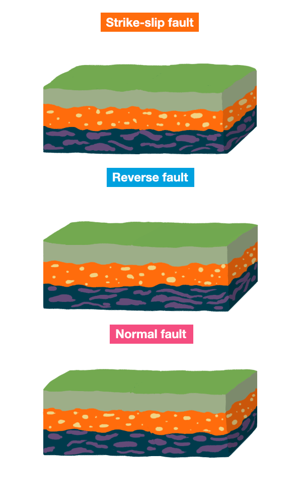

  <h1>Earthquakes</h1>
  <h2>A vast network of seismographs measure vibrations around the Earth and detect earthquakes. This website visualises the earthquakes and aims to show interesting trends.

  The database includes only earthquakes classified as significant. An earthquake is considered significant if it results in fatalities, causes moderate damage (approximately $1 million or more), has a magnitude of 7.5 or higher, reaches a Modified Mercalli Intensity of X or greater, or generates a tsunami.</h2>
  <a href="https://www.ngdc.noaa.gov/hazel/view/hazards/earthquake/event-data">Link to the dataset↗︎</a>

---

## What is an earthquake?
An earthquake occurs due to the release of energy from the Earth's crust, particulary present at the boundaries of tectonic plates. Movement of the Earth's crust continuously builds up energy, eventually releasing through seismic waves, resulting in an earthquake. This release of energy happens at so called faults, and can happen in 3 types (see image).

*source: https://scienceexchange.caltech.edu/topics/earthquakes/what-causes-earthquakes*

# The location of earthquakes
Earthquakes do not appear randomly, this page explains where earthquakes have mostly occured and why.

[Link](explore)

# Lethality of earthquakes
Not every earthquake is as deadly, this of course has to do with the magnitude. But how great is the correlation between magnitude and deadliness?

[Link](lethality)

# Link with focal depth
Earthquakes do not originate from the surface. They start from points deeper inside the crust and send waves upwards, what is the effect of this depth on the damages and casualties?

[Link](magnitude_damage)

